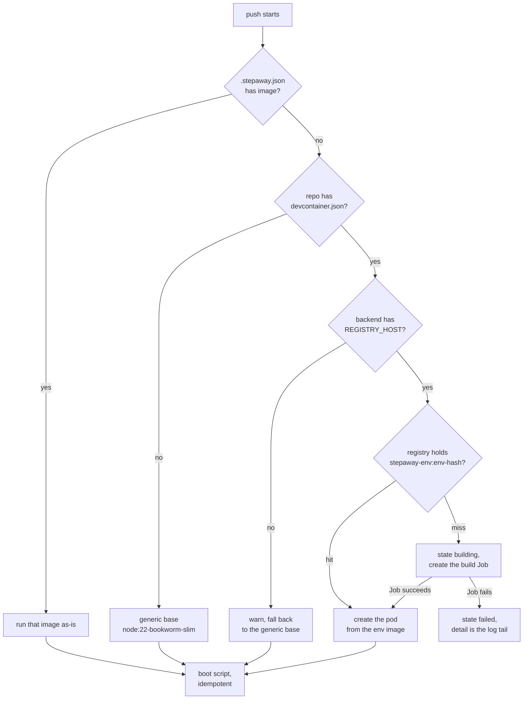

# Environment and build

The runner environment is not hardcoded. A project brings its own image or its
own `devcontainer.json`. This document gives the resolution order, the build
contract and the requirements of the registry.

## Resolution order

The first match wins. The boot script stays idempotent in all three cases. It
installs the Claude Code CLI only when the image does not already carry it, so
any image works and a prepared image is only faster.

## The hash

The CLI computes `envHash` as a sha256 over the sorted relative paths and the
contents of `.devcontainer/**`, or of the single `.devcontainer.json`. It
keeps the first 16 hex characters.

The hash names cluster objects, so the backend validates it hard. It accepts 8
to 64 lowercase hex characters and nothing else.

The hash produces four names:

| item | name |
|---|---|
| image tag | `stepaway-env:env-<hash>` |
| build Job | `stepaway-build-<hash8>` |
| env spec Secret | `stepaway-envspec-<hash8>` |
| Job label | `stepaway.dev/env-hash=<hash>` |

Two sessions with the same hash share one build Job. The backend looks up the
label before it creates a Job.

## The cache probe

The backend does `GET /v2/stepaway-env/manifests/env-<hash>` on the registry.
The answer has three meanings:

- 200 is a hit. The backend creates the pod at once.
- 404 is a miss. The backend starts a build.
- Any other answer is an error, and the backend raises it.

A broken registry must never look like a cache miss. A miss would start a
build that cannot push.

## The build Job contract

The Job runs the builder image with a privileged dind sidecar. The entrypoint
in `builder/entrypoint.sh` freezes the contract.

Environment variables:

| variable | meaning |
|---|---|
| `ENVSPEC_PATH` | path of the tar.gz inside the `/spec` mount |
| `IMAGE_REF` | full reference to build and to push |
| `REGISTRY_HOST` | host and optional port, no scheme |
| `REGISTRY_USER` | user for the registry login |
| `REGISTRY_PASS` | password for the registry login |
| `STEPAWAY_FEATURE` | OCI reference of the stepaway feature |
| `DOCKER_HOST` | dind sidecar, default `tcp://127.0.0.1:2375` |

The Secret mount:

- The backend writes the devcontainer files as one base64 tar.gz into the
  Secret `stepaway-envspec-<hash8>`. The key is `files.tgz`.
- The Job mounts that Secret read-only at `/spec`.
- The backend deletes the Secret when the build ends, on both outcomes.

The payload limit is 1 MiB, and `api.ts` declares it. The backend also
verifies the base64 by a decode round trip before anything reaches the
cluster.

The steps of the builder:

1. It verifies the inputs and it waits for the dind sidecar.
2. It logs in to the registry.
3. It reads the archive and it refuses symlink and hardlink members.
4. It extracts into a fresh directory and it normalises the layout.
5. It runs `devcontainer build` with the stepaway feature merged.
6. It pushes the image.

Exit contract:

- Exit 0 means that the image is in the registry.
- A non-zero exit ends with one self-contained line that starts with
  `[builder] FAILED:`. The backend puts the tail of this log into the `detail`
  field of the failed session. The line must never contain a credential or an
  env value.

Timers: `activeDeadlineSeconds` is 1200 and `ttlSecondsAfterFinished` is 3600.

The TTL can reap a successful Job before the backend reads the verdict. In
that case the backend asks the registry again. The registry is the truth.

## The devcontainer feature

The build always merges `ghcr.io/augustinbegue/stepaway-feature`. The feature
installs Claude Code, tmux, git, jq, procps, curl, unzip and bun.

The builder image holds the default reference of the feature, and the Job does
not override it. One source therefore cannot drift from the other.

## The registry requirements

The chart ships the `twuni/docker-registry` subchart under the key `registry`.
It is disabled by default.

The value `registry.host` is required when you enable the registry. It must be
a name that the **nodes** resolve.

Reason: the kubelet pulls the image of a session pod. The kubelet runs on the
node host. It is outside the pod network and outside the search path of the
cluster DNS. A name such as
`stepaway-registry.<namespace>.svc.cluster.local:5000` therefore does not
resolve for the kubelet, and the pod stays in `ImagePullBackOff`.

The supported topology is one public DNS name with TLS from your ingress
controller. A node-local hosts entry or an insecure-registry setting in
containerd also works, but you own it.

Warning: Do not expose the registry without TLS. The docker client refuses a
plain HTTP registry unless every node opts in.

The chart wires three consumers of the registry credentials:

1. a dockerconfigjson Secret, used as the `imagePullSecrets` entry of the
   session pods,
2. the push credentials of the build Jobs,
3. the basic auth of the manifest checks of the backend.

The frozen names of the backend environment are `REGISTRY_HOST`,
`REGISTRY_USER`, `REGISTRY_PASS`, `REGISTRY_PULL_SECRET` and `BUILDER_IMAGE`.
An empty `REGISTRY_HOST` disables the devcontainer path.

Garbage collection of the registry is a manual operation. Run
`registry garbage-collect` yourself.
