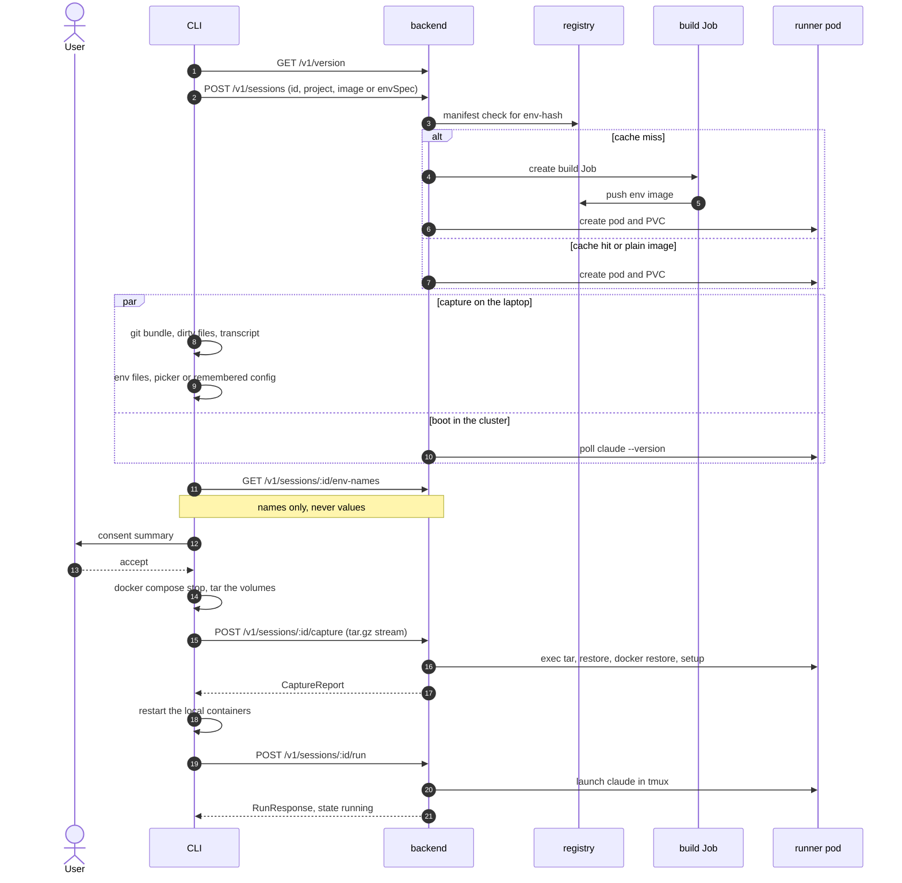
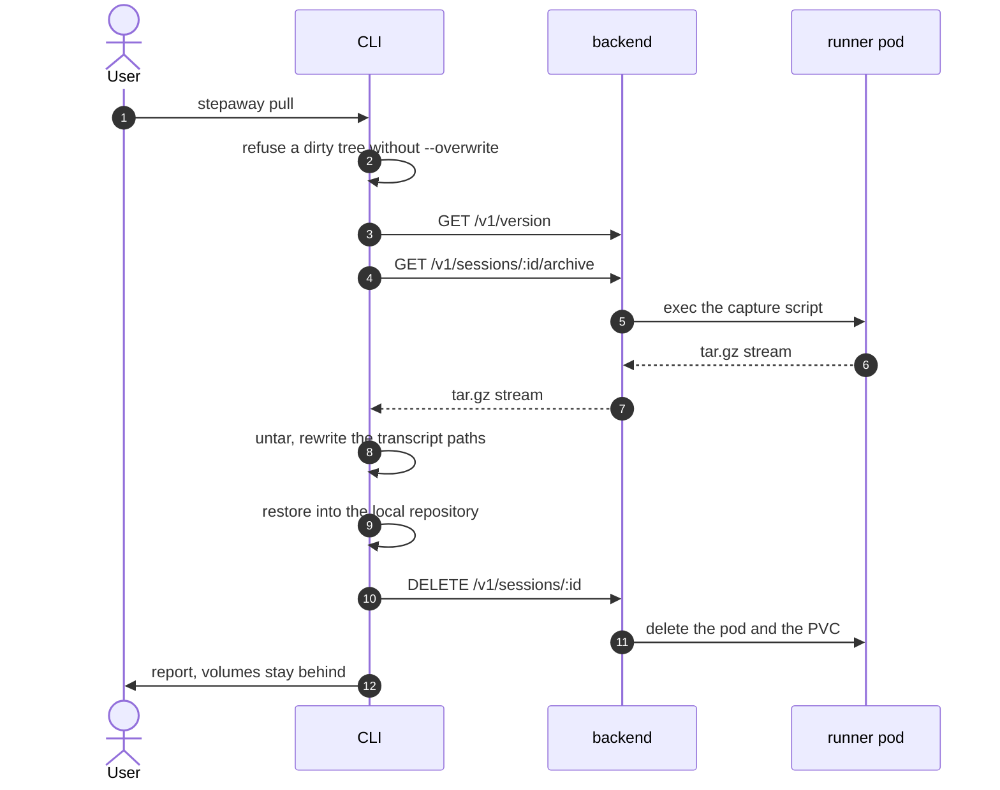

# Handoff flow

A handoff has two directions. `stepaway push` moves the session to the
cluster. `stepaway pull` brings it home. This document gives both.

## Push

### The phases of push

The list `PHASES` in `cli/src/commands/push.ts` holds the order:

1. **Backend preflight.** The CLI verifies that the backend answers and that
   the versions agree.
2. **Session create.** The CLI creates the session first, so the runner boots
   or the image builds during the capture. The session is empty and visibly
   `pending` or `building`.
3. **Capture.** The CLI collects the git bundle, the dirty files, the project
   config and one transcript.
4. **Env carry.** The CLI applies the remembered configuration, or it shows
   the picker. It strips the excluded variables and it applies the overrides.
5. **Ready wait and variable preflight.** The CLI asks which named variables
   the runner already satisfies. A required variable that no source satisfies
   blocks the push.
6. **Transfer plan.** The CLI computes the sizes and the file counts.
7. **Consent.** The CLI prints what moves and what does not move. Nothing left
   the laptop before this point.
8. **Docker quiesce.** The CLI stops the declared compose containers with a
   30 second timeout and it tars the volumes from the stopped state.
9. **Transfer.** The CLI streams the capture into the runner pod through the
   backend. The backend pipes the stream straight into `tar -xz` and then it
   runs restore, docker restore and setup.
10. **Launch.** The backend starts the unattended run in tmux.

### The consent gate

Step 7 is the only consent gate. These steps are behind it:

- the upload of the capture,
- the stop of the local containers,
- the start of the run.

An abort before step 7 deletes the empty session. The CLI arms this finalizer
as soon as it creates the session.

### The restart contract of the laptop

The CLI stops the local containers only to obtain a consistent copy of the
volumes. It starts them again after the capture. The laptop of the user must
not stay in a stopped state.

## Pull

### The phases of pull

1. **Dirty check.** A dirty local tree blocks the pull. The cluster is the
   source of truth after a handoff. The flag `--overwrite` proceeds.
2. **Archive.** The backend runs the same capture script on the runner and it
   streams the result. The backend stages nothing.
3. **Local restore.** The CLI unpacks the archive, rewrites the transcript
   paths to the local path and restores the branch and the dirty files.
4. **Teardown.** The CLI deletes the session only after a successful restore.

The pull is consent-gated by the dirty check alone. The user confirms with the
flag `--overwrite`.

Warning: The docker volumes stay on the runner. A pull deletes them with the
session. Copy any data that you need out of the volumes before the pull.
