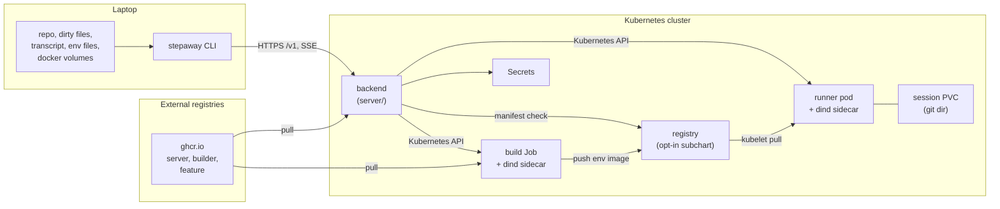

# Architecture overview

Stepaway moves a live Claude Code session from a laptop to a Kubernetes
cluster, and back. This document shows the components and their relations.

## Component diagram

The three subgraphs are the three trust zones. Section
[security.md](./security.md) gives the rules for each boundary.

## The CLI

The CLI is a single bundled file with no runtime dependencies. It runs on the
laptop of the user.

The CLI owns everything that touches the laptop:

- It reads the git repository, the dirty files and the transcript.
- It selects and filters the env files.
- It computes the hash of the environment specification.
- It prints the consent summary and it waits for the answer of the user.
- It stops and restarts the local compose containers.

The CLI must not use kubectl and must not read a kubeconfig. It knows one URL
and one bearer token. Every cluster operation goes through the API of the
backend.

## The backend

The backend is a Bun and Hono process in one Deployment. The Helm chart
installs it. It serves the frozen `/v1` REST and SSE surface that
`packages/core/src/api.ts` declares.

The backend owns the lifecycle of a session from end to end:

- It creates the runner pod and the session PVC.
- It creates the build Job on a cache miss.
- It pipes the capture stream into the runner pod.
- It runs restore, setup and launch inside the runner pod.
- It streams the transcript and the archive.
- It deletes the runner pod and the session PVC.

The backend keeps no database and no staging storage. The Kubernetes objects
hold all state. A restart of the backend loses nothing that matters.

The backend must not run project code in its own container. All project
commands run inside the runner pod through the exec API.

## The runner pod

One runner pod is one session. The pod name is `stepaway-<sid8>`. The label
`stepaway.dev/session` carries the full identifier of the session.

The pod has two containers:

- `runner`, from the resolved environment image. The boot script installs the
  Claude Code CLI when the image does not already contain it.
- `dind`, a privileged Docker daemon on `tcp://127.0.0.1:2375`. It runs the
  compose services of the project.

The runner pod owns the work tree, the run in tmux and the transcript. The
annotations of the pod hold the state of the session after the pod exists.

## The session PVC

The session PVC has the name of the runner pod. It mounts at `/repo` and it
holds the git dir of the project.

The PVC is the durable half of a session. The work tree is an emptyDir and it
is disposable by construction. Section
[session-lifecycle.md](./session-lifecycle.md) gives the full contract.

## The build Job

The backend creates a build Job when a session needs an environment image that
the registry does not hold. The Job runs the builder image with a dind sidecar.

The Job owns exactly one build of one environment hash. It reads the
devcontainer files from a Secret at `/spec`. It pushes the result to the
registry. It never touches a session, a repository or an env file.

## The registry

The registry is the `twuni/docker-registry` subchart. It is disabled by
default. It stores the built environment images under `stepaway-env`.

The registry must be reachable by the nodes, because the kubelet pulls the
image of the session pod. Section
[environment-build.md](./environment-build.md) explains why a cluster DNS name
fails here.

## The Helm chart

The chart in `charts/stepaway` owns every object of the control plane:

- the Deployment, the Service and the optional Ingress of the backend,
- the ServiceAccount, the Role and the RoleBinding,
- the Secret of the bearer token,
- the optional registry subchart with its auth Secret, its pull Secret and its
  Ingress,
- the opt-in ResourceQuota, LimitRange and NetworkPolicy objects.

The chart must not render a session pod. The backend creates session pods
imperatively from a template that it owns. This separation lets an operator
change the runner defaults with `helm upgrade` and no CLI release.

There are no CRDs and there is no operator.

## The devcontainer feature

The feature in `feature/` is an OCI artifact at
`ghcr.io/augustinbegue/stepaway-feature`. It installs the toolchain of a
runner: Claude Code, tmux, git, jq, procps, curl, unzip and bun.

Every devcontainer build merges this feature. The feature also works alone in
any Debian devcontainer, outside stepaway.

## The builder image

The builder image is `ghcr.io/augustinbegue/stepaway-builder`. It contains the
docker CLI, `@devcontainers/cli` and node. Its entrypoint is the frozen build
contract in `builder/entrypoint.sh`.
