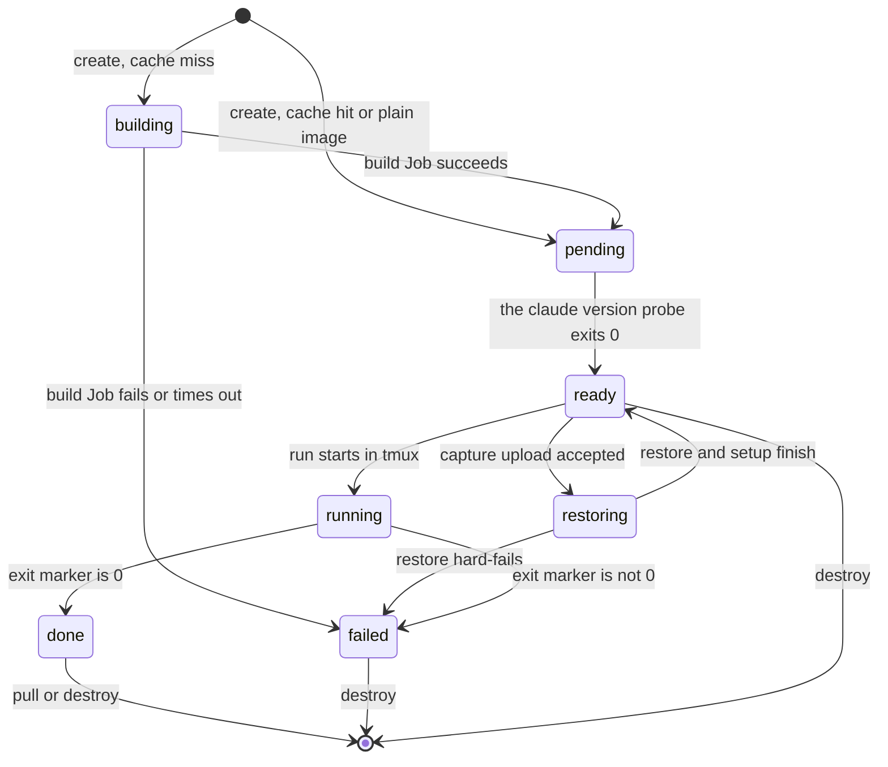

# Session lifecycle

A session is one pod, one PVC and one state. This document gives the states,
the triggers, the durability contract and the teardown rules.

## State diagram

The type `SessionState` in `packages/core/src/api.ts` freezes these seven
names.

## The states

| state | meaning |
|---|---|
| `building` | the environment image is in build. No pod exists yet. |
| `pending` | the pod and the PVC exist. The runner is still in boot. |
| `restoring` | the backend accepted the capture. Restore and setup run. |
| `ready` | the runner answers. No run is in progress. |
| `running` | the unattended run is in progress. |
| `done` | the run exited 0. |
| `failed` | the run exited non-zero, or a build or a restore hard-failed. |

## Who moves the state

The backend writes every state. No client writes a state.

Three mechanisms produce a transition:

1. **A direct action of the backend.** The routes `POST /v1/sessions`,
   `POST /v1/sessions/:id/capture` and `POST /v1/sessions/:id/run` each write
   the new state before they answer.
2. **A poll of the backend.** One poll watches the build Job. A second poll
   execs `claude --version` in the pod for the edge from `pending` to `ready`.
3. **A probe on read.** A read of a session in `pending` or in `running` can
   exec a probe and persist the result. The probe for `running` reads the exit
   marker that the launch wrapper writes on the runner.

The probes are idempotent and they read only the cluster. A restart of the
backend therefore costs a session nothing more than a delay.

## Where the state lives

The state lives in the annotations of a Kubernetes object. The key set is in
`server/src/sessions.ts`:

- `stepaway.dev/state`, the last state that the backend wrote,
- `stepaway.dev/project`, `stepaway.dev/created-at`,
  `stepaway.dev/remote-base`, `stepaway.dev/work-tree`,
- `stepaway.dev/exit-code` and `stepaway.dev/detail`,
- `stepaway.dev/env-hash`, `stepaway.dev/image` and
  `stepaway.dev/pull-secret`.

The holder of the annotations changes once:

- Before the pod exists, in state `building`, the annotations live on the
  session PVC. The PVC is the only object of the session at that moment.
- After the backend creates the pod, the annotations live on the pod. The pod
  is authoritative from that moment.

The backend prefers the pod when both objects carry a state. The PVC can keep
a stale value for a short time after the pod starts.

## The durability contract

The repository is restored with a separate git dir:

- The git dir is `/repo/<project>.git` on the session PVC. It is durable.
- The work tree is `/work/<project>` on an emptyDir. It is not durable.
- The work tree holds a `.git` **file** with the line
  `gitdir: /repo/<project>.git`.

Only git objects survive a crash of the pod, by construction. The system tells
the agent this fact. The launch appends the instruction: commit locally after
each coherent unit of work, because the repository survives a crash and the
work tree does not.

The docker volumes of the compose project live in the emptyDir of the dind
sidecar. They are not durable and `stepaway pull` does not bring them home.

## Teardown

There are two ways to end a session:

1. `stepaway pull`. On a successful restore on the laptop, the CLI calls
   `DELETE /v1/sessions/:id`. The backend deletes the pod and the PVC.
2. `stepaway destroy`. The CLI calls the same route for an abandoned handoff.
   The command asks for a confirmation. The flag `--yes` skips the prompt.

A session has no TTL. This absence is a decision, not an omission. See
[ADR 0001](../decisions/0001-one-pod-one-session.md). A session holds the only
copy of the work of the agent, so no timer may delete it.

The build Job has its own timers, because a Job holds no user work:
`ttlSecondsAfterFinished` is 3600 and `activeDeadlineSeconds` is 1200.

Warning: Do not delete a session PVC by hand while the state is `running`. The
commits of the agent live only there until a pull.
